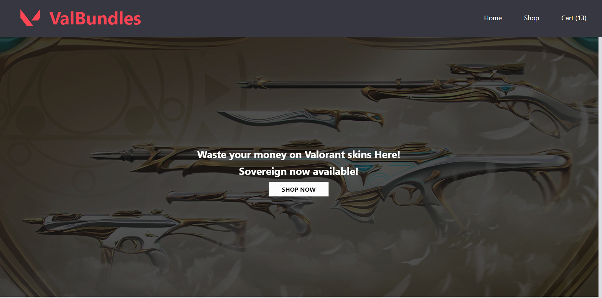
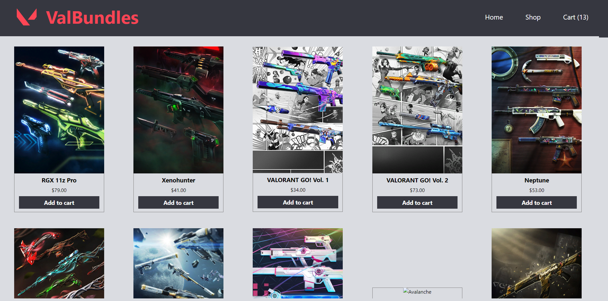
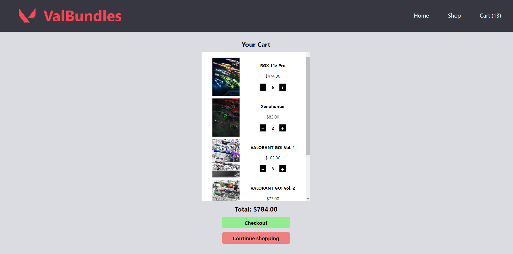

# Shopping Cart

Valorant themed shopping cart app built with react to gain more familiarity with routing and the react testing library. See screenshots of the application below.

## Demo 

[Live Demo](https://kmatic.github.io/shopping-cart)

## Built With

- [React](https://reactjs.org/)
- [styled-components](https://styled-components.com/)
- [Valorant API](https://valorant-api.com/)

## Skills learned/improved

- Handling react state
- structuring of react applications for data-flow
- react routing
- Jest w/ react testing library
- CSS (styled-components)

## Future ideas to extend

- Implement a checkout page
- Filtering of products
- Fully responsive design